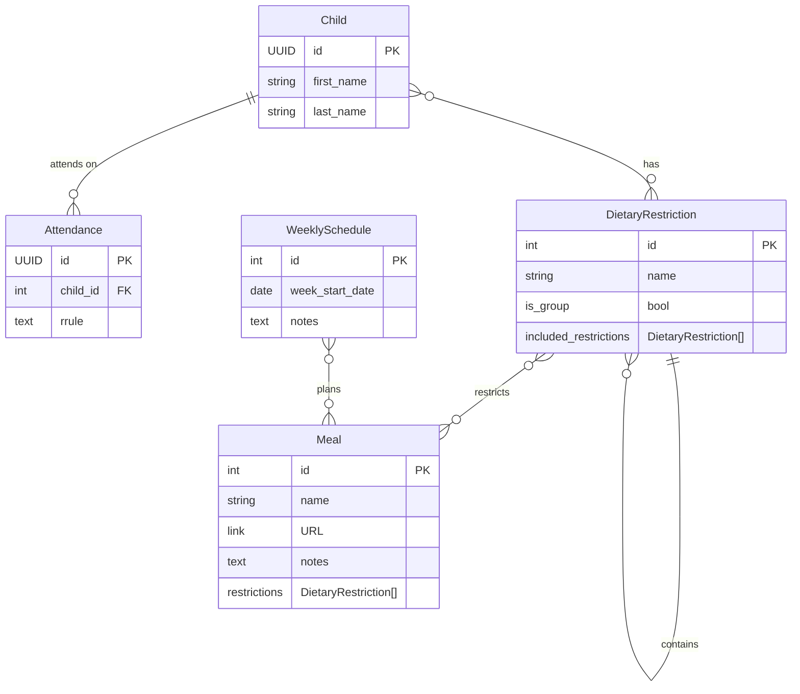

# kinderchef

## Architecture

## Product decisions

### Dietary restrictions

Should only direct restrictions (`is_group=False`) be considered for a meal?
Should empty category restrictions (`is_group=True`) be considered for a meal?
Consider the case where the planner adds a steak, but the vegan restriction is empty.
Should then the system consider the steak safe for the vegans?
Taking empty restrictions into account would allow the planner to restrict a meal to a group and add the meal to the weekly schedule while still adding the direct restrictions later.
Would this incentivize the planner's laziness? Without direct restrictions, other children might be falsely considered safe for a meal.

## Piku

### First deployment

- Create Procfile
- Create ENV
- Update settings.py
- Open port 80 in the firewall to allow the Let's Encrypt challenge
- Make sure you can compile psycopg2 and translations by running `apt install build-essential python3-dev libpq-dev gettext`
- Create a database with `just createdb`
- Configure the deployment remote with `just add-remote`
- Deploy with `just deploy`
- Create a django superuser with `just createsuperuser`

## TODO

- [ ] Migrate requirements.txt to pyproject.toml
