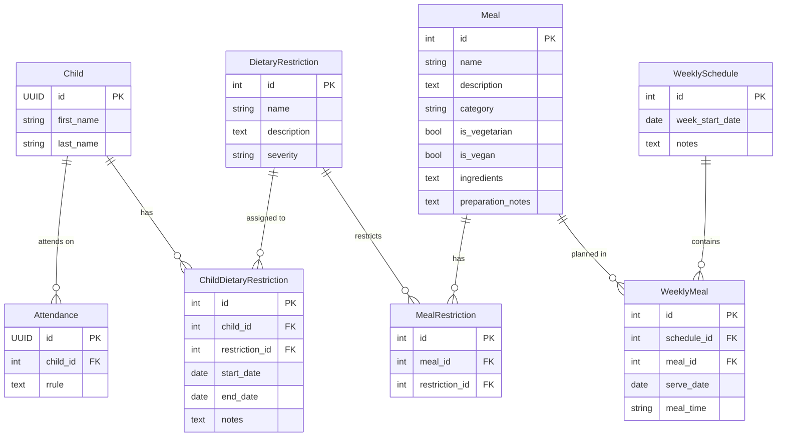

# kinderchef

## Architecture

## Piku

### First deployment

- Create Procfile
- Create ENV
- Update settings.py
- Open port 80 in the firewall to allow the Let's Encrypt challenge
- Make sure you can compile psycopg2 by running `apt install build-essential python3-dev libpq-dev`
- Create a database with `just createdb`
- Configure the deployment remote with `just add-remote`
- Deploy with `just deploy`
- Create a django superuser with `just createsuperuser`

## TODO

- [ ] Migrate requirements.txt to pyproject.toml
